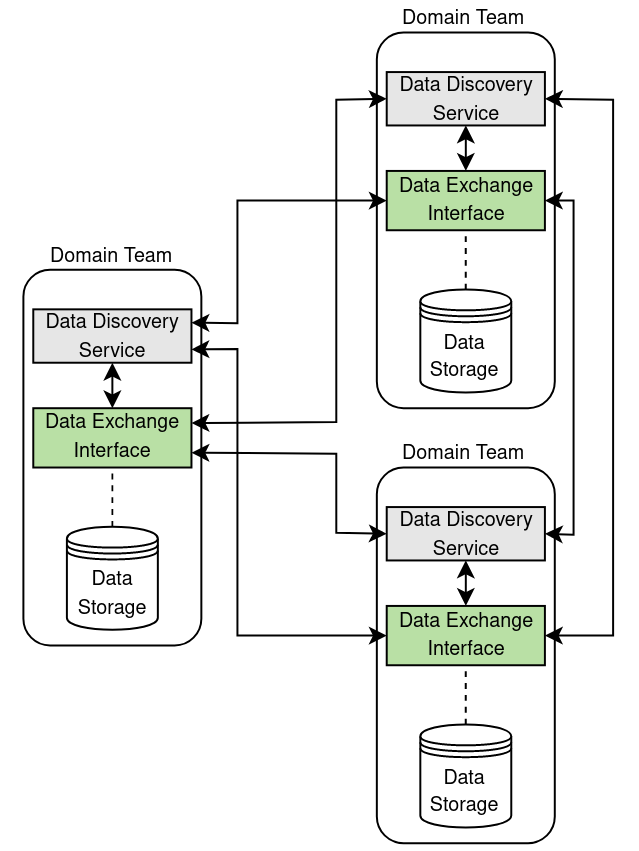

# Data Discovery in a DDoS Data Mesh Network
Distributed Denial-of-Service (DDoS) attacks have been a persistent and challenging issue on the Internet, leading to numerous proposals for countering these attacks from both centralized and distributed (cooperative) perspectives. One promising approach is the adoption of cooperative defense strategies. These can offer various benefits such as reducing the burden on individual domains, enhancing detection and mitigation capabilities and blocking malicious traffic closer to its source. However, implementing a cooperative defense in the highly diverse Internet environment is a complex task. The environment is extremely heterogeneous and encompasses diverse technologies, organizational structures and legal frameworks that pose their respecting set of challenges.

This repository aims to complement the work done as part of my bachelor thesis. It contains files necessary to replicate the design and implementation proposed in the thesis. 

## What is a DDoS Data Mesh Network?
A DDoS data mesh network describes a collaborative DDoS defense architecture. In a data mesh architecture, decentralized and autonomous domain teams hold data in local repositories. In the case of the DDoS data mesh network, that data consists of DDoS attack data. A data mesh network then allows the domain teams to query and exchange the data held by other domain teams. In the specific use case of a DDoS attack, this allows you to get an overview of the attack by combining the decentralized data stored at the domain teams. Data mesh networks, therefore, offer a decentralized approach to managing data inside an organization. Further, data mesh networks promote distributed architectures and domain-driven ownership of the data. Check out the official [data mesh architecture](https://www.datamesh-architecture.com/#why) website for more information.

## How does it work?
The idea behind this architecture is to run three core components on every domain team of the data mesh:
- Data Storage
- A Data Exchange Interface
- A Data Discovery Service

The DDoS attack data of every domain team is stored inside the data storage component. A data exchange interface allows other domain teams to query and join that data with the DDoS attack data from other domain teams. The data discovery service finally allows for visualization and BI based on the data retrieved. The below visualization depicts a DDoS data mesh architecture with three domain teams. Each domain team runs the three core components:
<p align="center">

</p>

## Implementation
In the thesis, we deployed the data mesh with three VMs acting as the domain teams. Each of the VMs implemented and deployed the three core services described above. For the implementation of the services, we use the following tools:
- [MySQL](https://dev.mysql.com/doc/)
- [Trino](https://trino.io/docs/current/)
- [Apache Superset](https://superset.apache.org/docs/intro/)

On each domain team, we run MySQL instances to store the DDoS attack data. We use Trino as a distributed query engine that is able to query multiple, heterogeneous, data sources simultaneously. This allows us to query DDoS attack data from multiple domain teams (data sources / MySQL instances) in a single SQL statement. Finally, we use Apache Superset as a data discovery and BI tool. We can run queries against the data mesh from inside Superset and directly use the data retrieved to create visualizations.

Trino is deployed as a cluster. The cluster consists of at least one coordinator node and one or multiple worker nodes. Queries are sent to the coordinator node, which analyzes and optimizes the query. The coordinator node then distributes the query across the available worker nodes. The worker nodes retrieve the data from the data sources and perform the computation of the query. The resulting data is then returned to the coordinator node, which returns the result to the client that submitted the query. In the design and implementation proposed in the thesis, we run one Trino coordinator node and two Trino worker nodes. The below figure depicts the topology of the data mesh: 
<p align="center">

</p>

## Deployment
This section explains how to install, configure and run the tools necessary for the DDoS Data Mesh Architecture. Note that this is the set up for a single domain team. You can replicate this process on every domain team that is part of the collaborative defense to create your own DDoS Data Mesh Network. Start by cloning this repository on your machine:
```
git clone ...
```

### 1. Prepare the Data
The _fingerprints_ folder of this repository contains a set of generated DDoS fingerprints. The fingerprints were generated with [EDDD](https://github.com/calvin-f/EDDD), a tool created as part of a master's thesis at [UZH](https://www.uzh.ch/de.html). The generated base data set has been augmented to include duplicate fingerprints and attack vectors that include the ICMP protocol. An overview of the fields of a DDoS fingerprint can be found [here](https://github.com/ddos-clearing-house/ddos_dissector/blob/main/fingerprint_format.md). If you include multiple domain teams in your data mesh network, you might want to scatter these fingerprints across the domain teams. This allows you to simulate the decentralized recording of DDoS attack data on the domain teams. 

### 2. Setting up MySQL
For the storage of the DDoS fingerprints, we use MySQL instances at the domain teams. Below are the steps necessary to install, configure and run MySQL on your machine:
1. [Install MySQL](https://dev.mysql.com/doc/mysql-installation-excerpt/5.7/en/) on your machine.
2. Set up your MySQL instance. For this, create a database schema, tables to store your DDoS fingerprints and a user with remote access privileges to the created schema. The _init.sql_ file contains all commands necessary to set your MySQL instance up.
3. Allow remote MySQL connections: Open the mysqld.cnf file and change the bind address to be a wildcard entry `*`. On most Linux distributions, the file is located at _/etc/mysql/mysql.conf.d/mysqld.cnf_. If you have trouble editing the file, check out this [guide](https://phoenixnap.com/kb/mysql-remote-connection).
5. Load the fingerprints into the database. The _feed.py_ file contains a python script that loads the DDoS fingerprints in the fingerprints directory into the database. Note that if you have created a different database user or a different schema than the ones provided by the _init.sql_ file, you have to adapt the _feed.py_ file accordingly. Also note that the script only searches for fingerprints in a directory called fingerprints in this repository.
6. Once the fingerprints are stored in the database, check manually if they are available via the remote user. You can connect to the database by running the following command on a different machine:
```
mysql -u username -h mysql_server_ip -p
```

### 3. Setting up Trino
We run Trino using docker with the [Trino docker image](https://hub.docker.com/r/trinodb/trino) provided by Trino. Make sure that you have docker and docker compose installed on your machine. The _trino-config_ directory of this repository contains all the necessary files to configure your Trino instance. Check out the deployment section of the official [Trino documentation](https://trino.io/docs/current/installation/deployment.html) to see what the configuration files do. Before we can run Trino, make sure to check the following configurations:
- _config.properties_: Change the file according to your needs. If you plan for this installation to be a worker node, set the coordinator=true entry to false. Also make sure to edit the discovery URL to the URL/IP of your machine. 

  This is the example configuration for a coordinator node: 
  ```
  coordinator=true
  node-scheduler.include-coordinator=false
  http-server.http.port=8080
  discovery.uri=http://example.net:8080
  ```
    This is the example configuration for a worker node: 
  ```
  coordinator=false
  http-server.http.port=8080
  discovery.uri=http://example.net:8080
  ```

-_node.properties_: Change the `node.id` field to be a unique ID inside your data mesh. You can generate an ID by running the `uuidgen` command. Also make sure that the `node.environment` is the same for all domain teams of your data mesh.

The _catalog_ directory in the Trino configuration contains the data source of your domain teams. There, you can configure the access to the MySQL instances of your data mesh. For each domain team, create one _<domain_team_name>.properties_ file and specify the access credentials for the MySQL instance in the file. The example configuration provided here only contains one data source for the MySQL instance running on this machine that has been configured with the _init.sql_ file. Adapt this according to your needs

Once you have changed the configuration to match your use case, you can run Trino with the following command: 
```
docker run --name trino -d -p 8080:8080 --volume ./etc:/etc/trino trinodb/trino
```

### 4. Setting up Superset
We also run Superset using docker. To run Superset, cd into the _superset_ directory and run the following command:
```
sudo docker compose -f docker-compose-non-dev.yml up -d
```
Once Superset is running, you can access the Superset web app by visiting [http://localhost:8088/login/](http://localhost:8088/login/). By default, "admin" is set as both the username and the password. In the app, head to "settings" -> "database connections" and configure Trino as a new database connection. You can do this by selecting Trino as the display name and providing the URL of the coordinator node. For example: trino://random@<ip_of_coord_node>:8080 Note that the Trino user "random" is passed as an argument. With the default configuration of Trino, this user can be any placeholder. 

## Data Discovery
At this point, the whole architecture for one domain team should be running. If you have at least one coordinator and one worker node deployed in your data mesh, you can start to query the fingerprints. The database schemas of the domain teams can be accessed through the dot notation in SQL. For example, you can query the Fingerprints table of a specific domain team like this: <catalog_name>.<schema_name>.Fingerprints 
You can use the Superset SQL Lab as a SQL IDE to write your queries. When you submit a query, it is sent to the Trino coordinator node of your data mesh. The result of the query is then displayed in the Superset SQL Lab. From there, you can save the result as a dataset or create a visualization based on the resulting data.   

